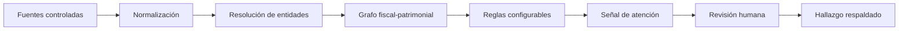

<div align="center">

# S.I.D.E.F.

### Sistema Inteligente de Detección de Evasión Fiscal

**Inteligencia fiscal basada en evidencia, relaciones y revisión humana.**

[](https://nextjs.org/)
[](https://www.typescriptlang.org/)
[](https://supabase.com/)
[](https://vercel.com/)

</div>

S.I.D.E.F. es una plataforma privada de análisis fiscal-patrimonial. Consolida datos gubernamentales y fuentes abiertas para construir relaciones entre personas, entidades, ingresos y bienes, y detectar inconsistencias que merecen investigación.

El sistema produce **indicios reproducibles y explicables**. Cada señal conserva sus fuentes, parámetros y cálculo; ninguna alerta determina por sí sola fraude, infracción o culpabilidad.

> [!IMPORTANT]
> La versión actual es un MVP demostrativo con datos sintéticos. No representa personas ni organizaciones reales.

## Espacio de investigación


La interfaz reúne en un único espacio la cola de trabajo, el grafo de relaciones, el inspector de evidencia y la línea temporal del caso. Los umbrales de atención son configurables para contemplar tolerancias patrimoniales, ingresos no observados y diferencias económicamente poco relevantes.

## Flujo operativo



| Etapa | Función |
| --- | --- |
| **Ingesta** | Incorpora conjuntos CSV/JSON controlados y fuentes públicas seleccionadas. |
| **Vinculación** | Relaciona sujetos, sociedades, domicilios, bienes y acontecimientos en el tiempo. |
| **Evaluación** | Compara patrimonio observado con capacidad económica estimada mediante criterios configurables. |
| **Investigación** | Permite revisar evidencia, procedencia, relaciones y cronología antes de comunicar un resultado. |

## Arquitectura del MVP

```text
Next.js + TypeScript       Interfaz y lógica de aplicación
Supabase / PostgreSQL      Persistencia, autenticación y políticas RLS
Vercel                     Despliegue demostrativo
CSV / JSON                 Ingesta controlada inicial
```

La arquitectura prioriza las capas gratuitas de Vercel y Supabase durante el desarrollo. El modelo de datos y la lógica de riesgo permanecen portables a un VPS o una instalación propia de PostgreSQL.

## Estado actual

- [x] Consola operativa adaptable a escritorio y móvil.
- [x] Cola de entidades y expediente contextual.
- [x] Grafo fiscal-patrimonial demostrativo.
- [x] Criterios de riesgo configurables.
- [x] Motor de cálculo con prueba automatizada.
- [x] Esquema inicial de Supabase con políticas RLS.
- [ ] Autenticación conectada al entorno productivo.
- [ ] Importación real de conjuntos de datos autorizados.
- [ ] Conectores a fuentes públicas seleccionadas.
- [ ] Exportación formal de hallazgos respaldados.

## Desarrollo local

### Requisitos

- Node.js 20 o superior
- pnpm
- Un proyecto de Supabase para habilitar persistencia

```bash
pnpm install
pnpm dev
```

Abrí [http://localhost:3000](http://localhost:3000). Sin credenciales de Supabase, la aplicación funciona con el escenario sintético incluido.

### Supabase

1. Creá un proyecto.
2. Aplicá [`supabase/migrations/202608020001_initial.sql`](supabase/migrations/202608020001_initial.sql).
3. Copiá `.env.example` como `.env.local` y completá las variables públicas.

```bash
pnpm test
pnpm build
```

## Estructura

```text
app/                    Interfaz Next.js
lib/                    Datos demostrativos y motor de riesgo
supabase/migrations/    Esquema PostgreSQL y seguridad RLS
Documentación/          Antecedentes y marco legal del proyecto
Palantir-plantillas/    Referencias visuales, no assets de producto
.impeccable/            Sistema y decisiones de diseño
```

## Principios

1. **Evidencia antes que inferencia.**
2. **Revisión humana antes de comunicar un hallazgo.**
3. **Toda señal debe poder reproducirse y explicarse.**
4. **La incertidumbre se configura; no se oculta.**
5. **Privacidad, procedencia y finalidad desde el diseño.**

## Alcance y responsabilidad

S.I.D.E.F. está pensado como una herramienta de apoyo a la investigación. El acceso a datos identificables, su conservación y cualquier comunicación a terceros deben responder a una finalidad legítima, fuentes autorizadas, controles de acceso y normativa aplicable.

---

<div align="center">

**S.I.D.E.F.** · Evidencia conectada para decisiones fiscales mejor fundamentadas.

</div>
