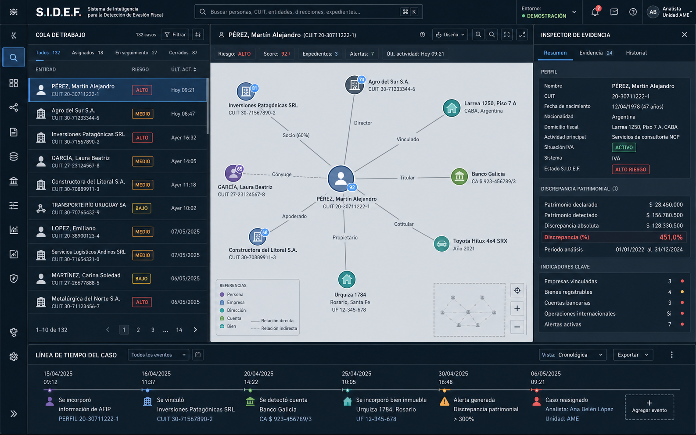
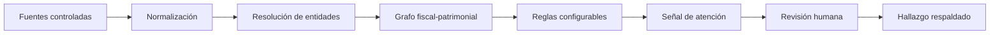

<div align="center">

# S.I.D.E.F.

### Sistema Inteligente de Detección de Evasión Fiscal

**Inteligencia fiscal basada en evidencia, relaciones y revisión humana.**

[](https://www.postgresql.org/)
[](https://www.proxmox.com/)
[](https://huggingface.co/Qwen/Qwen3-VL-32B-Instruct)
[](https://ai.google.dev/gemma/docs/core/model_card_4)

</div>

S.I.D.E.F. es una plataforma privada de análisis fiscal-patrimonial. Consolida datos gubernamentales y fuentes abiertas para construir relaciones entre personas, entidades, ingresos y bienes, y detectar inconsistencias que merecen investigación.

El sistema produce **indicios reproducibles y explicables**. Cada señal conserva sus fuentes, parámetros y cálculo; ninguna alerta determina por sí sola fraude, infracción o culpabilidad.

> [!IMPORTANT]
> La versión actual es un MVP demostrativo con datos sintéticos. No representa personas ni organizaciones reales.

## Espacio de investigación



La interfaz reúne en un único espacio la cola de trabajo, el grafo de relaciones, el inspector de evidencia y la línea temporal del caso. Los umbrales de atención son configurables para contemplar tolerancias patrimoniales, ingresos no observados y diferencias económicamente poco relevantes.

## Flujo operativo



| Etapa | Función |
| --- | --- |
| **Ingesta** | Incorpora conjuntos CSV/JSON controlados y fuentes públicas seleccionadas. |
| **Vinculación** | Relaciona sujetos, sociedades, domicilios, bienes y acontecimientos en el tiempo. |
| **Evaluación** | Compara patrimonio observado con capacidad económica estimada mediante criterios configurables. |
| **Investigación** | Permite revisar evidencia, procedencia, relaciones y cronología antes de comunicar un resultado. |

## Arquitectura del MVP

```text
Proxmox VE                 Infraestructura de virtualización
VM o contenedor LXC        Entorno aislado de ejecución
Next.js + TypeScript       Interfaz y lógica de aplicación
PostgreSQL                 Persistencia y políticas de acceso
Qwen3-VL-32B-Instruct      Análisis multimodal de documentos e imágenes
Gemma 4 31B                Razonamiento multimodal y contraste de resultados
CSV / JSON                 Ingesta controlada inicial
```

La arquitectura objetivo es autoalojada. Proxmox VE administra la infraestructura; S.I.D.E.F. se ejecuta dentro de máquinas virtuales o contenedores LXC, mientras PostgreSQL conserva los datos en una instancia controlada por el operador. La capa de inteligencia artificial prevista utiliza Qwen3-VL-32B-Instruct y Gemma 4 31B para procesar texto e imágenes, extraer evidencia de documentos y contrastar resultados antes de la revisión humana.

## Estado actual

- [x] Consola operativa adaptable a escritorio y móvil.
- [x] Cola de entidades y expediente contextual.
- [x] Grafo fiscal-patrimonial demostrativo.
- [x] Criterios de riesgo configurables.
- [x] Motor de cálculo con prueba automatizada.
- [ ] Esquema y autenticación adaptados a PostgreSQL autoalojado.
- [ ] Inferencia multimodal autoalojada con Qwen3-VL-32B-Instruct y Gemma 4 31B.
- [ ] Autenticación conectada al entorno productivo.
- [ ] Importación real de conjuntos de datos autorizados.
- [ ] Conectores a fuentes públicas seleccionadas.
- [ ] Exportación formal de hallazgos respaldados.

## Desarrollo local

### Requisitos

- Node.js 20 o superior
- pnpm
- PostgreSQL será necesario al habilitar la persistencia

```bash
pnpm install
pnpm dev
```

Abrí [http://localhost:3000](http://localhost:3000). La aplicación funciona actualmente con el escenario sintético incluido; la conexión a PostgreSQL autoalojado forma parte de la siguiente etapa.

```bash
pnpm test
pnpm build
```

## Estructura

```text
app/                    Interfaz Next.js
lib/                    Datos demostrativos y motor de riesgo
Documentación/          Antecedentes y marco legal del proyecto
Palantir-plantillas/    Referencias visuales, no assets de producto
.impeccable/            Sistema y decisiones de diseño
```

## Principios

1. **Evidencia antes que inferencia.**
2. **Revisión humana antes de comunicar un hallazgo.**
3. **Toda señal debe poder reproducirse y explicarse.**
4. **La incertidumbre se configura; no se oculta.**
5. **Privacidad, procedencia y finalidad desde el diseño.**

## Alcance y responsabilidad

S.I.D.E.F. está pensado como una herramienta de apoyo a la investigación. El acceso a datos identificables, su conservación y cualquier comunicación a terceros deben responder a una finalidad legítima, fuentes autorizadas, controles de acceso y normativa aplicable.

## Licencia y confidencialidad

Este repositorio contiene software propietario y confidencial. **No se concede permiso de uso, copia, modificación, distribución ni explotación comercial** sin autorización previa y escrita del titular. Consultá la [licencia propietaria](LICENSE) para conocer las condiciones aplicables.

---

<div align="center">

**S.I.D.E.F.** · Evidencia conectada para decisiones fiscales mejor fundamentadas.

</div>
